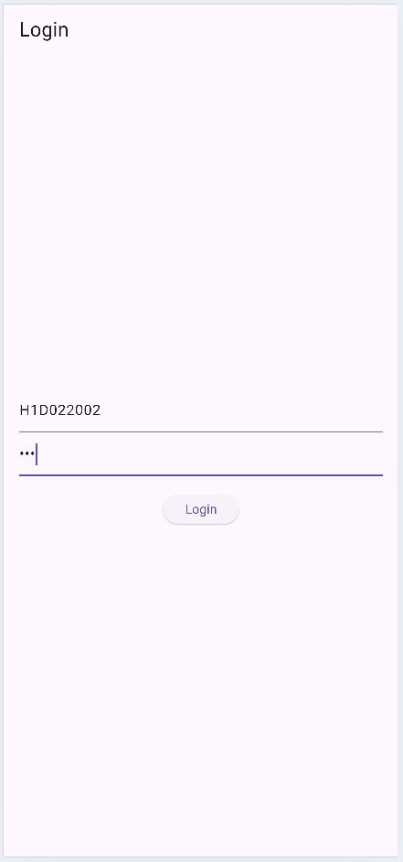
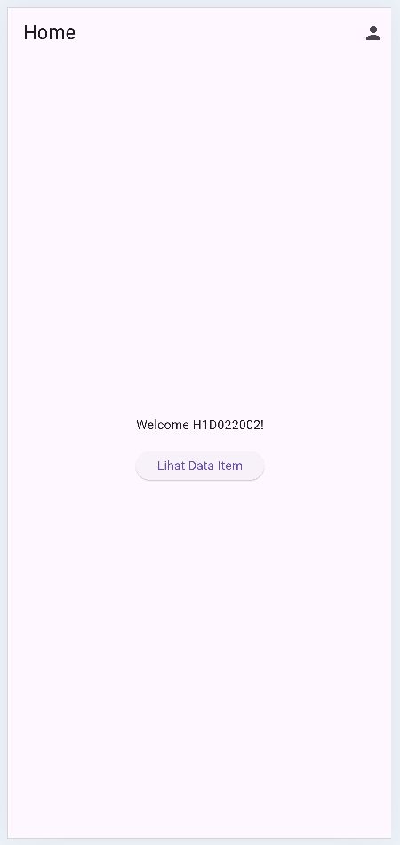
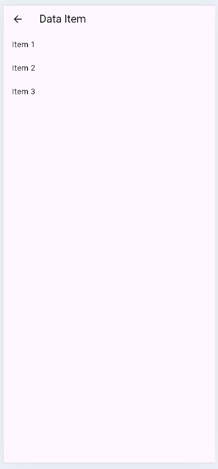
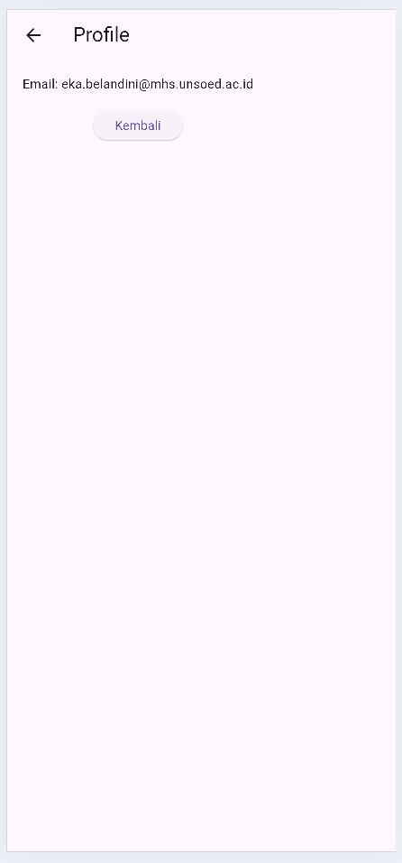

# Tugas Pemrograman Mobile - Tutorial Flutter GetX

**Nama**: Eka Belandini  
**NIM**: H1D022002  
**Prodi**: Informatika  
**Mata Kuliah**: Pemrograman Mobile  
**Kelas**: A  
**Dosen Pengampu**: Mohammad Irham Akbar, S.Kom., M.Cs.  

## Deskripsi Proyek

Proyek ini merupakan aplikasi mobile berbasis Flutter yang menggunakan **GetX** untuk manajemen state dan navigasi antar halaman. Fitur aplikasi mencakup autentikasi login, tampilan halaman utama, data item, serta profil pengguna.

## Struktur Kode dan Penjelasan

1. **controllers/**: Menyimpan logika aplikasi, termasuk autentikasi dan pengelolaan data.
2. **views/**: Menyimpan tampilan untuk setiap halaman (Login, Home, Data, dan Profil).
3. **routes/**: Menyimpan konfigurasi rute navigasi antar halaman.

### Cara Menjalankan Aplikasi

1. Clone repositori dari GitHub: [GetX-Flutter](https://github.com/belandiniekaa/GetX-Flutter)
2. Tambahkan package GetX di `pubspec.yaml` dengan perintah:
   ```bash
   flutter pub add get
   ```
3. Jalankan aplikasi dengan:
   ```bash
   flutter run
   ```

## Potongan Kode Penting

### LoginController
`LoginController` mengelola autentikasi pengguna. Berikut cuplikan kode dari controller ini:

```dart
class LoginController extends GetxController {
  var isLogged = false.obs;

  void login(String username, String password) {
    if (username == 'H1D022002' && password == '123') {
      isLogged.value = true;
      Get.offAllNamed('/home');
    } else {
      Get.snackbar('Error', 'Username atau password salah');
    }
  }
}
```

**Penjelasan**: Controller ini mengelola status login menggunakan variabel `isLogged`. Jika autentikasi berhasil, pengguna diarahkan ke halaman utama. Jika tidak, pesan error ditampilkan.

### HomeView
`HomeView` menampilkan halaman utama setelah login berhasil.

```dart
class HomeView extends StatelessWidget {
  final HomeController homeController = Get.put(HomeController());

  @override
  Widget build(BuildContext context) {
    return Scaffold(
      appBar: AppBar(title: Text('Home')),
      body: Center(
        child: Obx(() => Text('Welcome ${homeController.userName.value}!')),
      ),
    );
  }
}
```

**Penjelasan**: `HomeView` menggunakan `Obx` untuk menampilkan nama pengguna secara reaktif, sehingga perubahan data langsung terlihat di tampilan.

## Demo Aplikasi

Berikut adalah beberapa screenshot dari aplikasi yang menunjukkan tampilan dan fitur yang ada:

### Screenshot Halaman Login


### Screenshot Halaman Utama


### Screenshot Halaman Data


### Screenshot Halaman Profil


---

Dengan GetX, aplikasi ini memiliki struktur yang modular dan navigasi yang lebih mudah, sehingga pengembangan aplikasi menjadi lebih efisien.
